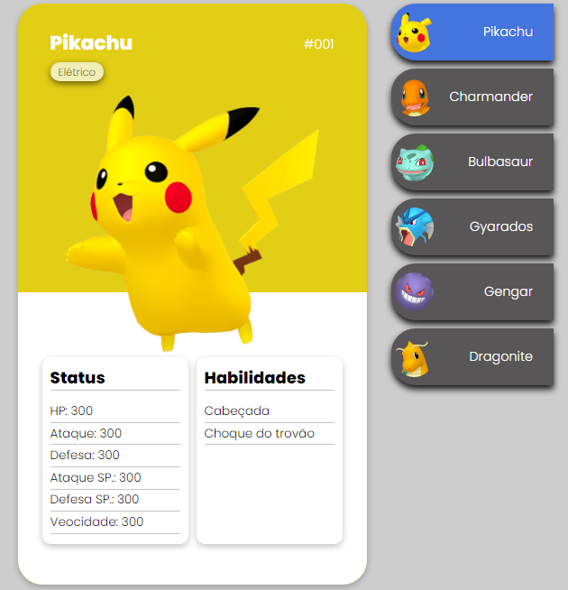
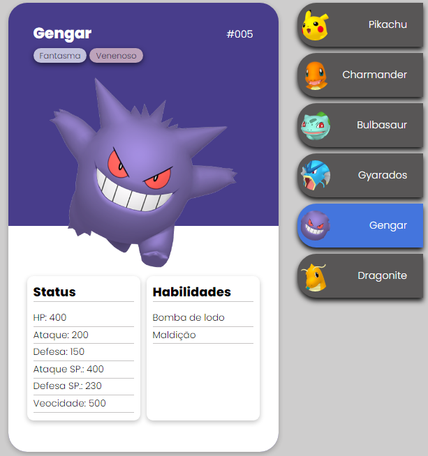
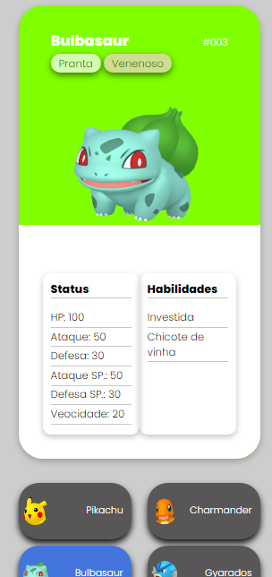
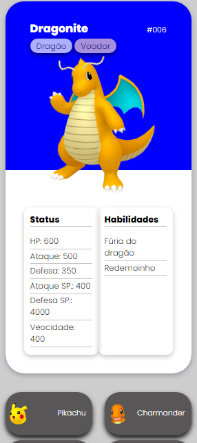

<h1 align="center">Projeto de estudo  </h1> 
<h2 align="center">Página web, responsiva, criada com: CSS, HTML e JavaScritp</h2>
 

<h3>Praticando estrutura do HTML. Manipulação de padding, border e margin. Responsividade com flexbox e eventos de mouse como click e hover.<h3>

<h3>Para acessar à página,  <a href="https://kleitonmq.github.io/Pokedex-Inaceitavel/">clique aqui.</a></h3>
 
<h4 align="center">Screenshots em navegador desktop.</h4>

<h4 align="center">Screenshot em dispositivo mobile.</h4>

